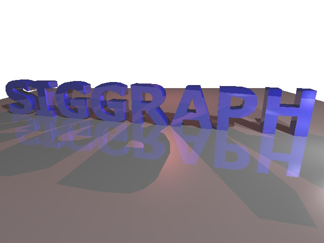
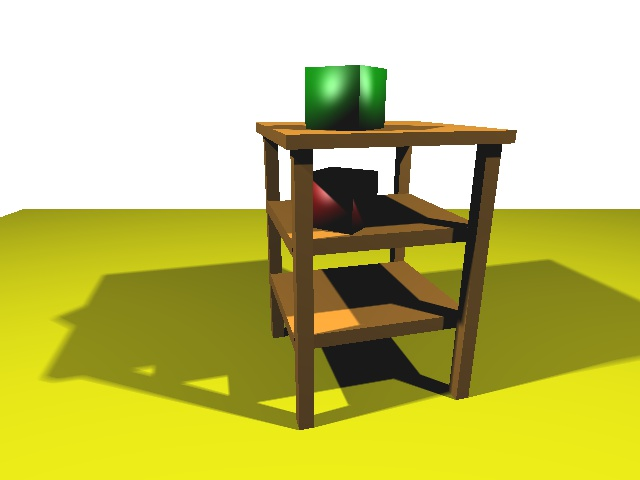

Assignment #3: Ray tracing

FULL NAME: Junmeng Xu

Example
------------------

MANDATORY FEATURES
------------------

<Under "Status" please indicate whether it has been implemented and is
functioning correctly.  If not, please explain the current status.>

Feature:                                 Status: finish? (yes/no)
-------------------------------------    -------------------------
1) Ray tracing triangles                  yes, functioning correctly

2) Ray tracing sphere                     yes, functioning correctly

3) Triangle Phong Shading                 yes, functioning correctly

4) Sphere Phong Shading                   yes, functioning correctly

5) Shadows rays                           yes, functioning correctly

6) Still images                           yes, functioning correctly
   

7) Extra Credit (up to 10 points)

   Soft shadows                           yes, functioning correctly

   Recursive reflection                   yes, functioning correctly

INTRODUCTION
------------
Build a ray tracer. The ray tracer is able to handle opaque surfaces with lighting and shadows. Uniformly send out rays from the camera location, it can either only plot to the screen, or both to the screen and a JPEG file (640x480), with the intersection code and the illumination equations (phong shading) for Triangle and Sphere. It also handles shadows rays.
In addition, it enables Recursive reflection and Soft shadows.

ENVIRONMENT
-----------
This program is developed in Mac OS X.

Please make sure there are below files:

* pic/Pic.h : I reused the "pic" library in homework 1. As a reminder, the "pic" directory has to be located one level above the assignment 3 directory

* extra/ : 5 rendered images (extra credit)
	• extra-test2-softShadows.jpg : soft shadows example
	• extra-table-softShadows.jpg : soft shadows example
	• extra-SIGGRAPH-recursiveReflection1times.jpg : recursive reflection example with 1 time reflection
	• extra-spheres-recursiveReflection2times.jpg : recursive reflection example with 2 time reflection
	• extra-SIGGRAPH-recursiveReflection2times_softShadows.jpg : soft shadows and recursive reflection example with 2 times reflection

* code/ : main code, makefile and scene files
	• assign3.cpp
	• Makefile
	• test1.scene : a gray sphere
	• test2.scene : a triangle, ground plane and sphere
	• table.scene : five spheres
	• spheres.scene : a table and two boxes
	• SIGGRAPH.scene : SIGGRAPH

* 5 rendered images (basic results)
	• test1-result.jpg
	• test2-result.jpg
	• table-result.jpg
	• spheres-result.jpg
	• SIGGRAPH-result.jpg

COMMAND
-------
* make : make assign3.cpp
* ./assign3 <scene filename> : plot scene to the screen
	example: ./assign3 spheres.scene
* ./assign3 <scene filename> <JPEG filename> : plot scene to the screen and a JPEG image
	example: ./assign3 spheres.scene spheres-test.jpg

OPERATION
---------
* Keyboard
  * S: switch to enable or disable soft shadows
  * Q: set there is only primary ray, number of reflection times is 0
  * W: set there is reflections as well as primary ray, number of reflection times is 1
  * E: set there is reflections as well as primary ray, number of reflection times is 2
  * R: set there is reflections as well as primary ray, number of reflection times is 3

Notice: The scene will be drawn and output a new JPEG (if applicable) again every time press a key.

EXTRA CREDIT
------------
* Soft shadows: Transfer the original point light to a sphere light to let the shadow rim soft.
* Recursive reflection: For recursive reflection, I call my ray tracer recursively. It still fires the shadow rays and compute a local Phong color, exactly as in non-recursive ray tracing. The final color equal (1 - ks) * localPhongColor + ks * colorOfReflectedRay.
